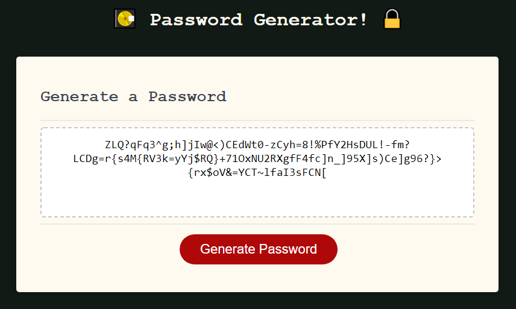

## WELCOME:
This is the README.md for the Challenge THREE "Password Generator" for the UT Coding Bootcamp.

This is a website featuring javascript enabling you to generate random strings of characters depending on your preferences.

Use them for a password if you so choose!

## HOW TO:
Press the button to begin making a password.  
Follow the prompts; the password must be between 8 and 128 characters long and use at least one character option (e.g. lowercase characters).

## VISIT:
<a href="https://lawhornmatt.github.io/Ch3_PasswordGenerator/" target="_blank">Click here to create a new arbitrary password!</a>

## SCREENSHOT:

## CREDIT:
Matthew Lawhorn, July 2022

## P.s.:
I began greatly expanding my password generator for eventual inclusion with my portfolio.  
On recommendation of my TAs, I have forked my repo and aligned my code closer to the strict GIVEN-WHEN-THEN Acceptence Criteria.  
The homework branch, the one displayed here and in the link, are the application and code intended to be graded.